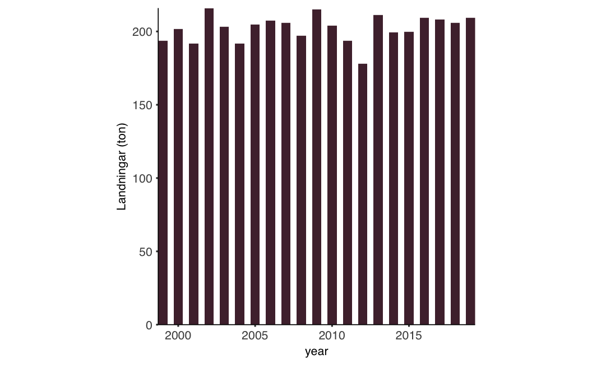

<!-- README.md is generated from README.Rmd. Please edit that file -->

# ggaqua

Contains a simple theme for ggplot2, `theme_aqua()`, that is based on
SLU Aqua report style. The theme builds on `ggplot2::theme_bw()`.

Installing:

``` r
# install.packages("devtools")
devtools::install_github("maxlindmark/ggaqua")

# slu aqua colors
if (!require(remotes)) {
install.packages(remotes)
}
remotes::install_github("kagervall/SLUcolors")
```

Below is an example plot of a time series of catch of Pike in the large
lakes in Sweden (a dataset that is built in here called “pike”).

``` r
library(ggplot2)
library(ggaqua)
library(SLUcolors)

pal <- SLUpalette(1)

d <- data.frame(year = 1999:2019, 
                response = rnorm(mean = 200, sd = 10, n = length(1999:2019)))

# a basic slu-aqua themed plot
ggplot(d, aes(year, response)) + 
  geom_bar(stat = "identity", width = 0.6, fill = pal[1]) +
  scale_x_continuous(expand = c(0, 0), breaks = scales::pretty_breaks(n = 6)) +
  scale_y_continuous(expand = c(0, 0), breaks = scales::pretty_breaks(n = 5)) +
  theme_aqua() + 
  labs(y = "Landningar (ton)", x = "")
  
# save!
#ggsave("Fig_1.png", plot = p1, dpi = 300, width = 8, height = 8, units = "cm")
```


